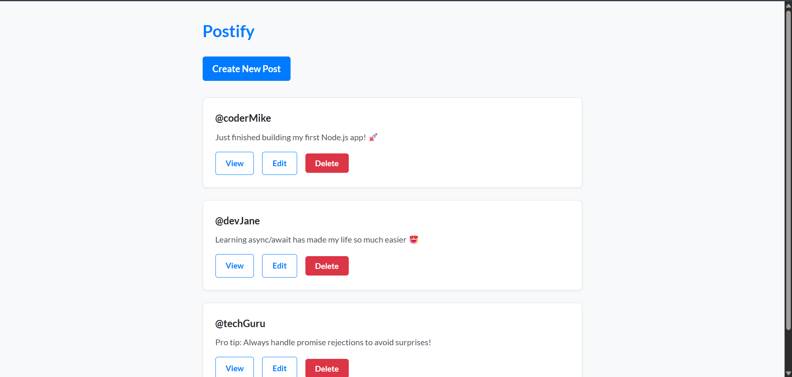
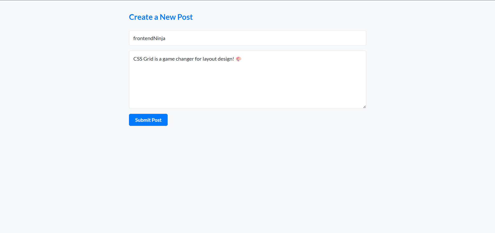
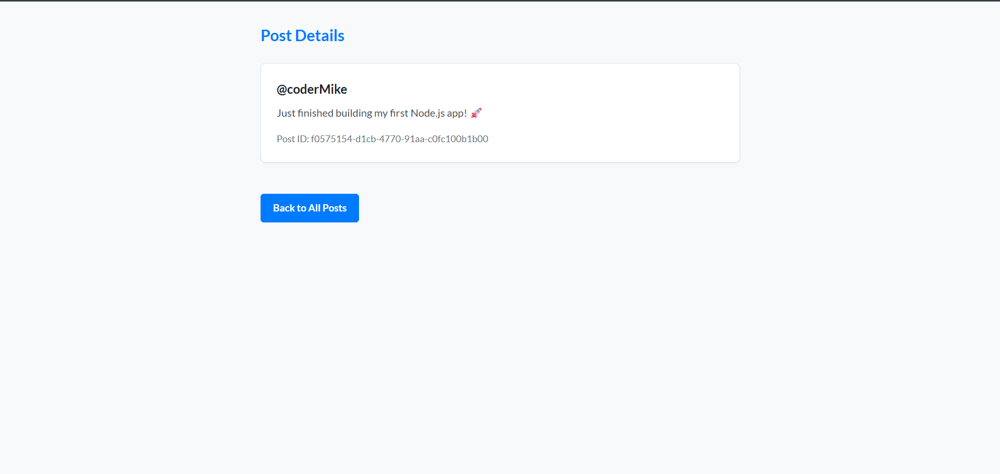
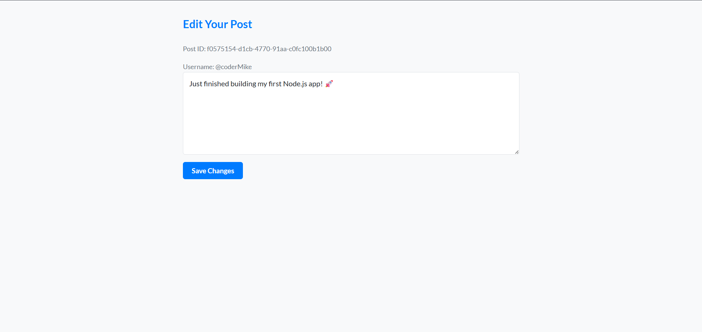

# Postify - A Simple CRUD Web App

A simple but fully functional web application built with Node.js and Express that allows users to create, read, update, and delete short posts. This project was created to practice and demonstrate fundamental concepts of backend web development and RESTful API design.

## Screenshots

## Screenshots

_1. The main page, listing all user posts._


_2. The 'Create New Post' page with its form fields._


_3. The 'View Post' page showing a single post in detail._


_4. The 'Edit Post' page, allowing users to update their content._


## Features

- **Create Posts:** Users can add a new post with a username and content.
- **Read Posts:** View all posts on the main page and view a single post in detail.
- **Update Posts:** Edit the content of an existing post.
- **Delete Posts:** Remove a post from the list.

## Technologies Used

- **Backend:** Node.js, Express.js
- **Frontend:** EJS (Embedded JavaScript templates), CSS
- **Database:** In-memory JavaScript array (for demonstration purposes)
- **Other Tools:** `uuid` for unique IDs, `method-override` for PATCH/DELETE requests.

## 🧠 Project Learnings

This project was a great opportunity to solidify my understanding of the fundamentals of full-stack development. Key takeaways include:

- **RESTful Routing:** Gained hands-on experience designing a RESTful API structure with Express, correctly mapping HTTP methods (GET, POST, PATCH, DELETE) to specific CRUD operations.

- **Server-Side Rendering:** Learned how to dynamically render HTML pages using the EJS templating engine, passing data from the server to the client to create a dynamic user experience.

- **Problem-Solving with Middleware:** Understood the power of Express middleware to solve specific challenges. A key learning was implementing the `method-override` package to handle `PATCH` and `DELETE` requests from HTML forms, which natively only support GET and POST.

- **State Management without a Database:** For the scope of this project, I learned to manage application state using a simple JavaScript array as an in-memory database. This was a practical way to focus on core data manipulation logic (finding, filtering, and updating objects) without the complexity of a full database.

## 📂 Project Structure

<pre> /postify-app ├── assets/ # Contains project screenshots ├── public/ │ └── css/ │ └── style.css # Main stylesheet (Light & Dark themes) ├── views/ │ ├── index.ejs # Shows all posts │ ├── new.ejs # Form to create a new post │ ├── show.ejs # Shows a single post in detail │ ├── edit.ejs # Form to edit a post ├── .gitignore # Specifies files to ignore (e.g., node_modules) ├── index.js # Main server file (Express setup and routes) ├── package.json # Project dependencies and scripts └── README.md # You are here! </pre>

## How to Run This Project Locally

1.  Clone the repository:

    ```bash
    git clone https://github.com/RutvijDev/nodejs-express-crud-post.git
    ```

2.  Navigate into the project directory:
    ```bash
    cd node-js-express-crud-post
    ```
3.  Install the necessary dependencies:
    ```bash
    npm install
    ```
4.  Start the server:
    ```bash
    node index.js
    ```
5.  Open your browser and go to `http://localhost:8080/posts`.
